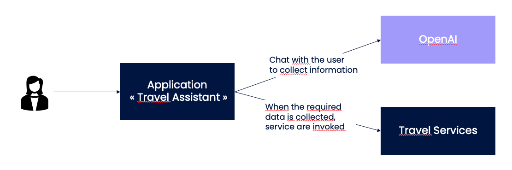
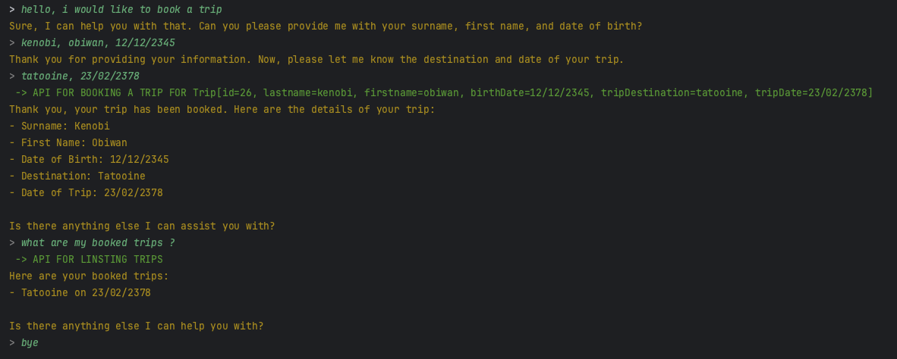

# travel-assistant

The goal of this project is to show how we can use `langchain4j` to create an application based on AI/LLM.

It is a simple use case:
* We have a travel booking assistant.
* We can chat to him to specify our travel wishes and when he has all the information, the application invokes a service to book the trip.
* You can also ask the assistant for the weather forecast for your holiday destination (another service is invoked in this case).

For this application, we use:
* annotations provided by langchain4j: `@Tool` (to describe the service that can be invoked) and `@SystemMessage` (to describe the context)
* OpenAI as the chat language model

In the following example, we can see the chat, the service invocations when the assistant has the required data:

